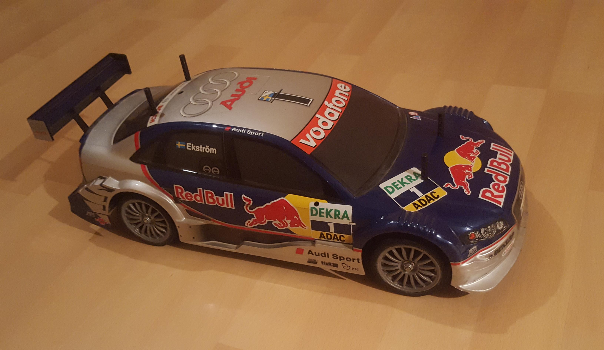
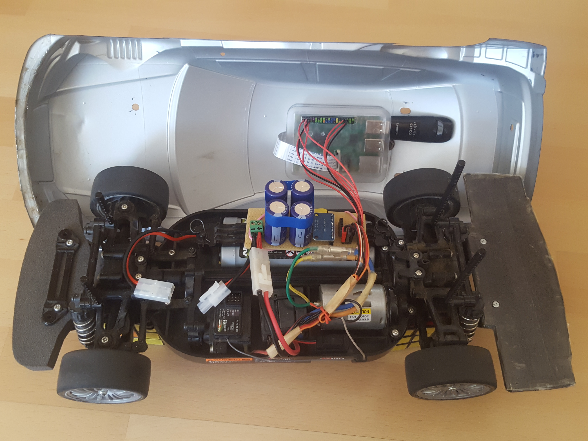
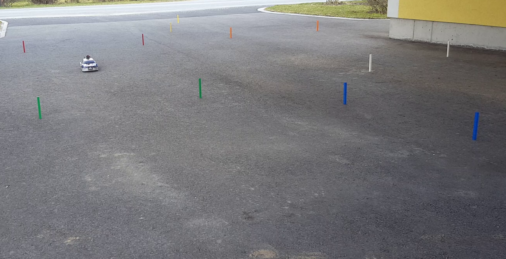

# Introduction

The goal of this project is to modify a conventional RC car, so it can be controlled remotely over a network. Therefore, we will replace the radio receiver of an existing RC car with a network-compatible device. The RC car we are going to modify is already in the possession of the author.

# Hardware

The unmodified RC car is shown in [@fig:hardware-existing] and consists of the following components:

- Chassis with motor: *Tamiya TT-01*
- Steering servo: *Graupner C 577*
- Speed controller: *Tamiya TEU-101BK*
- Rechargeable battery: *ANSMANN 2000mAh 7.2V*

{#fig:hardware-existing}

In [@fig:diagram-old] we can see an illustration of the electronic modules of the unmodified car.

{#fig:diagram-old}

## Additional Hardware

To control the car over a network connection we need to replace the radio receiver with a network-compatible computer. This computer must be small enough to fit in the chassis of the car. Therefore, we use a *Raspberry Pi 2 Model B* with a *MicroSDHC-Card 32GB - SanDisk Extreme Pro* running *Raspberry Pi OS*^[[https://www.raspberrypi.org/software/](https://www.raspberrypi.org/software/)], which is a Linux-based operating system. To see where the car is driving, we mount a camera module for Raspberry Pis on the top of the car. To connect the Raspberry Pi to a local network, we use a Wi-Fi to USP adapter *Cisco-Linksys WUSB600N v2*. In [@fig:diagram-new] we can see an illustration of our modifications.

{#fig:diagram-new}

To save weight, we do not want a second battery supplying the Raspberry Pi with power. The car is already equipped with a battery for the motor, but it has a voltage of 7.2V, while the Raspberry Pi requires a voltage of 5V. Therefore, we use a Step-down-Converter *TSR 3-1250*, which can be configured to output 5V. Because we are using the same battery as the motor, the voltage drops significantly during acceleration after a car standstill. Therefore, we use four parallel-connected capacitors with a capacity of 12mF to overcome those voltage drops. We also want to measure the battery voltage with an Analog-Digital-Converter (ADC). [@fig:electrical-wiring] shows the wiring diagram of a board featuring all components.

{#fig:electrical-wiring}

In [@fig:hardware-modified] we can see the board inside the car connecting the components. The battery voltage is measured by an ADC *ADS1115*.

{#fig:hardware-modified}

## Mocking the Radio Receiver

Two Pulse Width Modulation (PWM) signals are used for the communication between the radio receiver and the speed controller. One PWM signal is used to control the steering angle and the other PWM signal is used to control the speed of the car. The controller only considers PWM signals with 50Hz and a duty cycle between 5% and 10% as valid signals. In case of an invalid signal, the car stops, a red LED is blinking on the controller and a beep-sound is played. In [@fig:diagram-pwm] we can see how a valid PWM signal looks like.

{#fig:diagram-pwm}

By varying the duty cycle, we can adjust the speed and the steering angle. To generate the PWM signals, we will use the General-Purpose Inputs/Outputs (GPIO) of the Raspberry Pi.

# Software

We will use a client-server architecture to build our software. The Raspberry Pi inside the car will act as server while a computer connecting to the car will act as client. The client has to send the desired speed and steering angle periodically to the server. If the server does not receive such message from the client before a certain timeout, the car will immediately stop. We are going to transfer the video stream of the camera using a separate connection.

To allow reusability of the software in other projects, the software is split into a library called `rcpicar`, which can be found on GitHub^[[https://github.com/franzmandl/rcpicar](https://github.com/franzmandl/rcpicar)], and an example application using this library, which will be described later in [@sec:examples].

The library favors composition over inheritance by defining interfaces, which get implemented by base classes. Those base classes do not get inherited anymore.

Python 3.7 is already installed on Raspberry Pi OS, but this Python version does not support interfaces (protocols^[[https://www.python.org/dev/peps/pep-0544/](https://www.python.org/dev/peps/pep-0544/)]) yet. So, in Python 3.7, interfaces are basically abstract classes without any members or constructor. In our library, all interfaces are prefixed with the letter `I`.

## Services {#sec:services}

The software is organized in services. Each service has exactly one concern. A service is an entity which can have three states: *not started*, *running* and *stopped*. After starting a service, the state changes from *not started* to *running*. During startup, a service can allocate resources and/or start threads. Stopping the service should release any allocated resources and stop any started threads. The service is now in the state *stopped*.

Most services are indented to start and stop only once per application run. Whether a service needs all three states depends on the purpose and implementation of the service. The library contains services which neither need to be started nor stopped. Those services do not have any state and do not need to implement any interface. Some services do not need to be started, but they need to be stopped. Those services implement the interface `IStartedService` and add themselves to a service manager. Services needing all three states implement the interface `IService` and add themselves to a service manager.

For starting and stopping multiple services at once, we can use a service manager. A service manager implements the interface `IServiceManager`. A service manager can also wait till all services are in the state *stopped*.

## Packaging

In Python, a package can be a file with the file ending `.py` or a directory containing a file called `__init__.py`. The root package `rcpicar` contains various sub packages. In our library, file sub packages often just declare interfaces. Those sub packages are listed and described bellow:

- `rcpicar.clock` defines an interface called `IClock`, which defines various time-dependent methods.
- `rcpicar.constants` defines some static immutable values.
- `rcpicar.message` defines a singleton called `message_types` and an interface called `IMessage`. A message is indented to be sent over a network. Therefore, a message can be encoded as bytes and those bytes can also be decoded to a message object again.
- `rcpicar.process` defines an interface called `IProcess` describing a child process spawned by the application.
- `rcpicar.queue_` defines an interface called `IQueue` which should be implemented by thread-safe queues.
- `rcpicar.receive` defines two interfaces `IReceiveListener` and `IReceiveService`. A receive listener waits for a message and a receive service manages such listeners.
- `rcpicar.reliable` defines various interfaces describing a reliable connection, e.g. using the Transmission Control Protocol (TCP).
- `rcpicar.send` defines an interface called `ISendService` to send a message.
- `rcpicar.service` defines three interfaces `IService`, `IStartedService` and `IServiceManager` as already described in [@sec:services].
- `rcpicar.socket_` defines an interface called `ISocket` describing the socket Application Programming Interface (API) of an operating system.
- `rcpicar.unreliable` defines various interfaces describing an unreliable connection, e.g. using the User Datagram Protocol (UDP).

The root package `rcpicar` also contains directories. Those directory sub packages implement the interfaces defined in the file sub packages. Most directory sub packages contain two classes which names end with `ClientService` or `ServerService`. Those classes contain service code which is supposed to run on the client- or server-side respectively. There might also be classes which names end with `ServiceArguments`. Those classes allow to alter certain parameters of a service. It is also possible to allow the user to specify certain parameters as command line argument. Some directory sub packages also define classes which names end with `Message`. Those classes implement the interface `IMessage` and should also define a static method `decode(message: bytes)` to create a certain message object from bytes. All directory sub packages are listed and described bellow:

- `rcpicar.car` contains logic for controlling the car. It allows to set the speed and steering angle of the car by calling a method `update(speed: int, steering: int)`. The speed must be given as integer between -100 and 100, where -100 means 100% backward speed, 0 means stop, and 100 means 100% forward speed. The steering angle must also be given as integer between -100 and 100, where -100 means 100% steer left, 0 means straightforward, and 100 means 100% steer right.
- `rcpicar.client` contains a recommendation on how to plug all services together on the client-side while allowing to override each service.
- `rcpicar.discovery` can be used to discover the IP address of the car server in a network. This is done by sending some magic bytes as broadcast.
- `rcpicar.expire` filters out-of-order messages by adding a message number to each message. While sending messages over a network, the message might arrive in a different order on the receive side. TCP already takes care of message ordering, but UDP does not.
- `rcpicar.gpio` controls the PWM output signals of the Raspberry Pi's GPIOs.
- `rcpicar.gstreamer` handles a H.264 video stream by spawning and terminating a `gst-launch-1.0`^[[https://gstreamer.freedesktop.org/documentation/tools/gst-launch.html](https://gstreamer.freedesktop.org/documentation/tools/gst-launch.html)] and `raspivid`^[[https://www.raspberrypi.org/documentation/usage/camera/raspicam/raspivid.md](https://www.raspberrypi.org/documentation/usage/camera/raspicam/raspivid.md)] process. Note that only one instance of `raspivid` can be running at a time.
- `rcpicar.latency` measures the connection quality by periodically sending a message and measuring the response time.
- `rcpicar.log` uses Python's `logging` package for log output and logging to a log file.
- `rcpicar.priority` enables the possibility of supporting multiple clients.
- `rcpicar.promise` allows to synchronously wait for a value in one thread while it is computed in another thread. It is inspired by Futures^[[https://docs.oracle.com/javase/8/docs/api/java/util/concurrent/Future.html](https://docs.oracle.com/javase/8/docs/api/java/util/concurrent/Future.html)] in Java and Promises^[[https://developer.mozilla.org/en-US/docs/Web/JavaScript/Reference/Global_Objects/Promise](https://developer.mozilla.org/en-US/docs/Web/JavaScript/Reference/Global_Objects/Promise)] in JavaScript.
- `rcpicar.routed` provides a message router which enables sending different message types using the same connection by prepending a single byte to each message.
- `rcpicar.server` contains a recommendation on how to plug all services together on the server-side while allowing to override each service.
- `rcpicar.stop` can be used to stop the server from the client side.
- `rcpicar.tcp` implements a reliable connection using TCP.
- `rcpicar.throttle` uses the `rcpicar.latency` package to measure the network quality and applies a speed throttle.
- `rcpicar.timeout` can be used for sending and receiving periodical messages.
- `rcpicar.udp` implements an unreliable connection using UDP.
- `rcpicar.util` contains various utility classes and functions. Some of them are listed and described bellow:
    - `rcpicar.util.argument` uses Python's `argparse` module to provide a convenient way to offer service parameters as command line arguments.
    - `rcpicar.util.Atomic` and `rcpicar.util.AtomicInteger` have a built-in lock to lock their value.
    - `rcpicar.util.IdealQueue` is a queue designed for multiple threads putting items on the queue while one thread consumes those items in a loop. In contrast to Python 3.7's `queue` package, the items here can have a generic data type.
    - `rcpicar.util.InterruptableSleep` allows a thread to sleep, but can also get interrupted by another thread.
    - `rcpicar.util.Lazy` allows lazy evaluation of a value. Once a value got calculated by calling a method `get()`, the value gets stored and is never calculated again. By using `rcpicar.util.Lazy` we allow the concrete application to override service parameters or even whole services. In [@sec:override-an-existing-service] it will be described how to override services.
    - `rcpicar.util.Placeholder` stores exactly one value or `None` if the value was not set yet or if it was cleared. Threads can wait for the value to come available using promises provided by `rcpicar.promise`.
    - `rcpicar.util.Process` implements the interface `IProcess` using Python's `subprocess.Popen`^[[https://docs.python.org/3/library/subprocess.html#popen-constructor](https://docs.python.org/3/library/subprocess.html#popen-constructor)] class.
    - `rcpicar.util.MultiServiceManager` implements the interface `IServiceManager` and can start and stop multiple service.
    - `rcpicar.util.RTC` implements the interface `IClock` using the real time.
    - `rcpicar.util.Socket` implements the interface `ISocket` using Python's `socket`^[[https://docs.python.org/3/library/socket.html](https://docs.python.org/3/library/socket.html)] package.

# Communication Protocol

For the communication between client and server the library provides a connection-oriented but reliable TCP connection and a connection-less but unreliable UDP connection. For sending different types of messages using the same connection we can use the services provided by the `rcpicar.routed` package. To send a message we can use an instance of `RoutedSendService`. The sender has to specify a message type, which is an integer number between 0 and 255. The receiver has to register as listener to an instance of `RoutedReceiveService` specifying the same message type. The library already defines five message types in the package `rcpicar.message`:

- `car` is used by the package `rcpicar.car` to update the car's speed and steering angle.
- `custom` is unused by the library and can be used by the library user to send application specific messages.
- `gstreamer` is used by the package `rcpicar.gstreamer` to negotiate the video stream parameters.
- `latency` is used by the package `rcpicar.latency` to measure the latency between server and client.
- `stop` is used by the package `rcpicar.stop` to shut down the server application.

A possible handshake between client and server might look like as illustrated in [@fig:protocol-handshake]. The client does not know the IP address and port of the server yet. Therefore, it sends a broadcast message and the server responds with its IP address and port. Then the client requests a video stream of the camera by sending a message of type `gstreamer`. The server provides the requested video stream and responds with a message of type `gstreamer`. A message of type `latency` can be sent any time by the server and the client has to send it back to the server as fast as possible. Then the client can start sending messages of type `car` to control the car as shown in [@fig:protocol-continous].

{#fig:protocol-handshake}

{#fig:protocol-continous}

## Car Message

A message to control the car consists of 6 bytes. Each service consumes specific bytes of the message. On the client side we can use the `CarClientService` to compose and send the message by calling the method `update(speed: int, steering: int)`. In the example shown in [@fig:protocol-car_message], the client commands the car to drive with 10% speed forward and steer 20% to the right. As a result, the `CarClientService` tells the `TimeoutSendService` to send this command periodically. The `ExpireSendService` adds an incrementing message number to every car message starting with 1. The `PrioritySendService` adds a byte to indicate that this message has normal priority. In the case that multiple clients would send messages, the message with the highest priority is taken. Before the message is sent using the `UdpService`, the `RoutedSendService` adds a byte to indicate that this is a message of type `car`. After receiving the message on the server side, the message gets decomposed by the corresponding services. The `RoutedReceiveService` consumes the first byte of the message and recognizes that it has received a message of type `car`. Then it forwards the rest of the message to the `PriorityReceiveService` which consumes the next byte. `ExpireReceiveService` consumes the next two bytes and checks whether the message arrived in the correct order. `TimeoutReceiveService` checks whether the message arrived in time, triggering a timeout otherwise. The `ThrottleServerService` might reduce the speed, depending on the current network latency. Finally, the `CarServerService` tells the `GpioServerService` to update the PWM signals of the GPIOs.

{#fig:protocol-car_message}

# Video Stream

For streaming the video recorded by the camera mounted on top of the car, we use *GStreamer*^[[https://gstreamer.freedesktop.org/](https://gstreamer.freedesktop.org/)]. GStreamer is an open source multimedia framework internally using the *GObject* library. GStreamer runs on many platforms including Microsoft Windows and Linux-based systems. Although GStreamer is written in C, bindings exist for other programming languages like Python. GStreamer also comes with a very powerful command line tool called `gst-launch-1.0`^[[https://gstreamer.freedesktop.org/documentation/tools/gst-launch.html](https://gstreamer.freedesktop.org/documentation/tools/gst-launch.html)].

GStreamer is based on the pipeline architecture. A pipeline consists of elements which can be connected with each other. Each element has at least one *source pad*, one *sink pad* or both. A sink pad represents the input of an element while a source pad represents the output. By connecting the source pad of one element to the sink pad of another element, we can construct our pipeline.

## Server Pipeline {#sec:server-pipeline}

The server pipeline should send the video provided by a `raspivid`^[[https://www.raspberrypi.org/documentation/usage/camera/raspicam/raspivid.md](https://www.raspberrypi.org/documentation/usage/camera/raspicam/raspivid.md)] process to a client. The following command writes a H.264-encoded video from the camera to the standard output:

```shell
raspivid -n -t 0 -h 720 -w 1280 -fps 30 -b 2000000 -o -
```

We can specify the height, width, frame rate and bit rate using the command line arguments `-h`, `-w`, `-fps` and `-b` respectivly. We take the standard output and pipe it in our GStreamer process `gst-launch-1.0`. The following command expects a H.264-encoded video from the standard input and sends it to a client:

```shell
gst-launch-1.0 -v fdsrc ! h264parse ! rtph264pay \
  ! udpsink host=$client_ip port=$port
```

Note that the variables `$client_ip` and `$port` need to be replaced.

`fdsrc`^[[https://gstreamer.freedesktop.org/documentation/coreelements/fdsrc.html](https://gstreamer.freedesktop.org/documentation/coreelements/fdsrc.html)] is the first element in our pipeline and it tells GStreamer to read the video from standard input. Using an exclamation mark `!` we can connect the source pad to the sink pad of the next element. The next element is `h264parse`^[[https://gstreamer.freedesktop.org/documentation/videoparsersbad/h264parse.html](https://gstreamer.freedesktop.org/documentation/videoparsersbad/h264parse.html)], which parses the H.264 video. `rtph264pay`^[[https://gstreamer.freedesktop.org/documentation/rtp/rtph264pay.html](https://gstreamer.freedesktop.org/documentation/rtp/rtph264pay.html)] payload-encodes the H264-encoded video into Real-time Transport Protocol (RTP) packets. Finally, `udpsink`^[[https://gstreamer.freedesktop.org/documentation/udp/udpsink.html](https://gstreamer.freedesktop.org/documentation/udp/udpsink.html)] sends UDP packets to the client.

The server pipeline is located in `rcpicar.gstreamer.GStreamerServerService`. We use Python's `subprocess` package to spawn those two processes and pipe the standard input to the standard output. We also parse the standard output of the `gst-launch-1.0` process and remember the capabilities, which will be important in the following section.

## Client Pipeline

The client pipeline receives the video stream. The following command listens a video stream and renders it on the client computer:

```shell
gst-launch-1.0 -v udpsrc port=$port caps='$caps' ! rtph264depay \
  ! avdec_h264 ! videoconvert ! autovideosink sync=false
```

Note that the variables `$port` and `$caps` need to be replaced. The value of `$caps` (capabilities) needs to be taken from the standard output of the `gst-launch-1.0` process on the server side as described in the previous [@sec:server-pipeline].

The pipeline consists of the elements `udpsrc`^[[https://gstreamer.freedesktop.org/documentation/udp/udpsrc.html](https://gstreamer.freedesktop.org/documentation/udp/udpsrc.html)], `rtph264depay`^[[https://gstreamer.freedesktop.org/documentation/rtp/rtph264depay.html](https://gstreamer.freedesktop.org/documentation/rtp/rtph264depay.html)], `avdec_h264`^[[https://gstreamer.freedesktop.org/documentation/libav/avdec_h264.html](https://gstreamer.freedesktop.org/documentation/libav/avdec_h264.html)], `videoconvert`^[[https://gstreamer.freedesktop.org/documentation/videoconvert/index.html](https://gstreamer.freedesktop.org/documentation/videoconvert/index.html)] and `autovideosink`^[[https://gstreamer.freedesktop.org/documentation/autodetect/autovideosink.html](https://gstreamer.freedesktop.org/documentation/autodetect/autovideosink.html)]. The element `udpsrc` listens to UDP packets while `autovideosink` renders the video stream.

The client pipeline is not located in the `rcpicar` library because its composition depends on the actual use case. The command above is just an example on how it might look like.

# Examples {#sec:examples}

We will have a look at a very simple client-server example using the `rcpicar` library. In eight steps we will create and execute a client application and a server application. Both, client and server, need to be connected to the same network. The client will read the desired speed and steering from the standard input and send it to the server. Speed and steering are both integers between -100 and 100. This example does not show the video stream of the camera yet because it does not have a graphical user interface.

## Simple Client Example

1. Install the library by running `pip install rcpicar[client]`.
2. Create a file with the following example content:

```python
from rcpicar.client.Client import Client

client = Client()
# Configure log
client.log_arguments.configure_log()
# Enable services
client.car_service.get()
client.latency_service.get()
# Start and run services
with client.use_services():
    while True:
        client.car_service.get().update(
            int(input('speed: ')), int(input('steering: ')))
```

3. Execute the file with Python.
4. Stop the application by sending a keyboard interrupt.

## Simple Server Example

1. Install the library by running `pip install rcpicar[server]`.
2. Create a file with the following example content:

```python
from rcpicar.server.Server import Server

server = Server()
# Configure log
server.log_arguments.configure_log()
# Enable services
server.car_service.get()
server.discovery_service.get()
# Start and run services
with server.use_services():
    input('Press ENTER to stop the server.')
```

3. Execute the file with Python.
4. Stop the application by pressing the enter key.

## Advanced Client-Server Example {#sec:advanced-example}

A more advanced example can be found on GitHub^[[https://github.com/franzmandl/rcpicar_example](https://github.com/franzmandl/rcpicar_example)]. This example uses the GTK library^[[https://gtk.org/](https://gtk.org/)] on the client side to render the video stream and binds the arrow keys on the keyboard to steer the car. The client pipeline is located in `rcpicar_example.gtk.GtkVideoService` and it uses a library providing GObject bindings for Python called `PyGObject`^[[https://pygobject.readthedocs.io/en/latest/](https://pygobject.readthedocs.io/en/latest/)]. The example also shows how to use already existing services from the `rcpicar` library as well as how to create a new service.

### Create a New Service

In the example we create a server service called `VoltageServerService` to measure the battery voltage using an ADC connected via the I²C bus. The service implements the interface `IService` and adds itself to a service manager because it needs to be started and stopped to require and release the I²C bus as a resource. We also create a client service called `VoltageClientService` to log the measured voltage. Since the service does not need to be started nor stopped it does not implement `IService` nor `IStartedService`. We also create a new message called `VoltageMessage`, which encodes and decodes the voltage as floating-point number. For sending the current voltage from the server to the client we want to use UDP. Therefore, we create a custom unreliable routed message service using the message type `custom` and create a new message type called `voltage`.

### Override an Existing Service {#sec:override-an-existing-service}

The example also shows how to override an existing service. The steering servo of car used for demonstration was not able to drive straightforward without a slight correction of the PWM signal. Therefore, we create a new GPIO server service called `TamiyaTt01` by implementing the interface `IGpioServerService`. The following line can be found in the server's main file and it wraps our custom GPIO service around the default GPIO service:

```python
server.gpio_service.set(TamiyaTt01(server.gpio_service.get()))
```

### Bypass the Throttle

The throttle service measures the latency between client and server and enforces a maximum speed according to the measured latency, as well as setting the maximum timeout between car messages. By default, the throttle service is enabled by the car service, but we can disable the throttle service by adding the following lines of code in our server's main file:

```python
# Bypass the throttle.
server.throttle_service.set(server.gpio_service.get())
# Set a constant timeout.
server.timeout_service.get().set_timeout(0.25)
```

### Command Line Arguments

Certain service parameters can easily be registered as command line parameters to the user. Many services already define useful parameters to be registered as command line arguments, but we might also ignore them or create our own command line parameters. The server's main file of the advanced example does both. It creates own command line arguments in the server's main file, while also registering recommended arguments:

```python
process_arguments([
    # Register recommended command line arguments.
    server.discovery_arguments,
    ...
    # Create and register own command line argument.
    create_value_argument(
        server.gpio_arguments.pwm_motor_maximum,
        '--pwm-motor-maximum', int,
        'Throttle max forward speed.'),
    ...
])
```

# Testing

The `rcpicar` library was created with huge concerns about type safety and testability. Therefore, the library defines many interfaces implemented by services, while also allowing to override or mock those interfaces.

## Automated Testing

Testing a multi-threaded application is not trivial compared to test a single-threaded application. Somehow, we have to synchronize the test with the state of the application. Therefore, a test case can either use the real time clock and wait for events to happen in the application or mock the time by controlling the clock by the test case.

All test cases can be found in the package `tests.case`, which contains three sub packages for system, integration and unit tests. Test cases using the real time are suffixed with `_rtc` while tests without this suffix are either time independent or they mock the time. Mocking the time is not difficult because, as already mentioned, the library defines an interface `IClock`, which contains all time-dependent method calls. A test case implements this interface and is now able to control the time. The package `tests.mock` already contains many useful implementations of interfaces defined by the library, which can be used to write test cases. The mock implementation of `IClock` located in `tests.mock.clock` has a method `tick()`, which increments the time of the application and notifies all time-dependent threads that the clock was updated using a condition variable.

All mocks in the package `tests.mock` are type-safe and allow to make assertions on the call history of some methods as well as waiting in a test case until a specific method has been called. We can also specify the implementation of certain methods by providing either a callback, a constant to return, an exception to throw, an iterable of return values, an iterator of return values or a dictionary containing a mapping of method arguments to return values.

## Manual Testing

The application described in [@sec:advanced-example] was also manually tested on a real race circuit as shown in [@fig:race_circuit-user; @fig:race_circuit-car]. The connection between the client computer and the car was established using a Wi-Fi access point provided by the Raspberry Pi. The maximal distance between the client computer and the car was 18m for this test. The `TimeoutReceiveService` was configured to stop the car if the server has not received a car message for 250ms. No such timeout happened during this test and `ExpireReceiveService` did not detect any out-of-order messages. A resolution of 1280x720 pixels was used to stream the video.

Increasing the distance between client computer and car without any obstacles decreases the signal strength. Timeouts got noticeable at about 80m since the car stopped at each timeout. The signal was completely lost at about 90m and the car stopped.

{#fig:race_circuit-user}

{#fig:race_circuit-car}

# Conclusion

As a result, two software projects were created:

- A Python library for developing a client-server software to control a RC car over a network. The source code can be found on GitHub^[[https://github.com/franzmandl/rcpicar](https://github.com/franzmandl/rcpicar)] and the corresponding Python package can be found on PyPI^[[https://pypi.org/project/rcpicar/](https://pypi.org/project/rcpicar/)].
- An application using the library, which can also be found on GitHub^[[https://github.com/franzmandl/rcpicar_example](https://github.com/franzmandl/rcpicar_example)].

## Limitations

GStreamer, which was used for video streaming, is available on most modern operating system, but the installation is much easier on Linux-based system than on Microsoft Windows.

Currently, the car is only able to fully handle one client at a time. This is because `TcpServerService` and `UdpService` cannot handle multiple client connections in parallel and, most important, `GStreamerServerService` can only send the video stream to one client at a time.

## Future Work

To circumvent the installation process on the client side, we might replace the Python client with a website directly hosted by the Raspberry Pi inside the car. This was tried using WebSockets and WebRTC, but it was not possible to create a real time video stream. The WebRTC library *aiortc*^[[https://github.com/aiortc/aiortc](https://github.com/aiortc/aiortc)] was used for the experiment, but there might be other more promising libraries available.

To fully support multiple clients, we might use a *tee*^[[https://gstreamer.freedesktop.org/documentation/coreelements/tee.html](https://gstreamer.freedesktop.org/documentation/coreelements/tee.html)] element to duplicate the video stream in `GStreamerServerService` or we can use GStreamer's RTSP server^[[https://gstreamer.freedesktop.org/documentation/gst-rtsp-server/rtsp-server.html](https://gstreamer.freedesktop.org/documentation/gst-rtsp-server/rtsp-server.html)]. In addition, `TcpServerService` and `UdpService` need to be extended to support multiple client connections.
